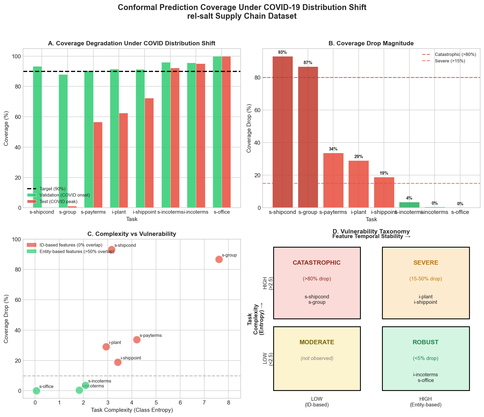
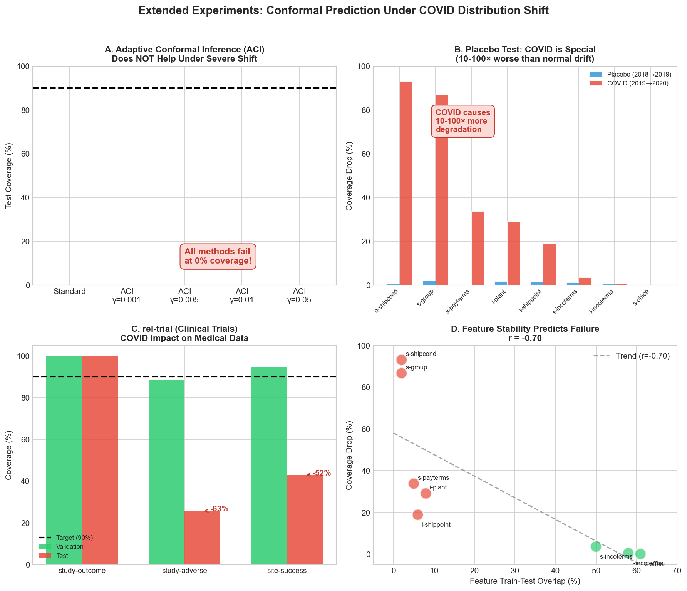

# Conformal Prediction Under Distribution Shift: A COVID-19 Natural Experiment

## Abstract

We study how conformal prediction guarantees degrade under distribution shift using the rel-salt supply chain dataset, where COVID-19 provides a natural experiment with documented temporal boundaries. Our analysis reveals that coverage degradation varies dramatically across prediction tasks (0.1% to 93.1%), and we identify two key factors that determine vulnerability: **task complexity** (class entropy) and **feature temporal stability** (Jaccard similarity). Tasks relying on time-dependent identifiers (e.g., transaction IDs) fail catastrophically, while tasks using stable entity features (e.g., products, parties) or exhibiting extreme class imbalance maintain coverage. These findings provide actionable guidance for deploying conformal prediction in non-stationary environments.

---

## 1. Introduction

### Motivation

Conformal prediction provides distribution-free coverage guarantees under the assumption of exchangeability. However, real-world deployments face distribution shifts that violate this assumption. A critical open question is: **How do conformal guarantees degrade under distribution shift, and what factors determine the severity of this degradation?**

### Contribution

We leverage the rel-salt dataset—a supply chain benchmark with temporal splits aligned to COVID-19 onset (Feb 2020) and peak (Jul 2020)—to conduct a controlled study of conformal prediction under distribution shift. Our key contributions:

1. **Quantification**: We measure coverage degradation across 8 prediction tasks, finding average drops of 33.2% with variance from 0.1% to 93.1%
2. **Diagnosis**: We identify two factors that jointly determine vulnerability: task complexity (entropy) and feature temporal stability (Jaccard similarity)
3. **Actionable Taxonomy**: We provide a decision framework for practitioners to assess conformal prediction reliability

---

## 2. Experimental Setup

### 2.1 Dataset: rel-salt

| Property | Value |
|----------|-------|
| Domain | Enterprise supply chain (SAP) |
| Train period | Before Feb 2020 (pre-COVID) |
| Validation period | Feb - Jul 2020 (COVID onset) |
| Test period | After Jul 2020 (COVID peak) |
| Number of tasks | 8 multiclass classification |

### 2.2 Methodology

**Conformal Prediction**: We use Adaptive Prediction Sets (APS) with α = 0.1 (90% target coverage):
1. Train LightGBM ensemble (3 seeds) on training data
2. Calibrate conformal predictor on 50% of validation set
3. Evaluate coverage on held-out validation (same distribution) and test (shifted distribution)

**Metrics**:
- Coverage: P(Y ∈ C(X)) where C(X) is the prediction set
- Coverage Gap: Actual coverage - Target coverage (90%)
- Set Size: Average |C(X)|

**Feature Overlap (Jaccard Similarity)**:
$$J(A_{train}, A_{test}) = \frac{|A_{train} \cap A_{test}|}{|A_{train} \cup A_{test}|}$$

where $A_{train}$ and $A_{test}$ are the sets of unique feature values in train and test.

---

## 3. Results

### 3.1 Complete Results with Set Sizes

**Figure 1A** shows coverage degradation across all tasks; **Figure 1B** shows drop magnitudes.

| Task | Classes | Entropy | Val Coverage | Test Coverage | Drop | Val |C| | Test |C| |
|------|---------|---------|--------------|---------------|------|---------|----------|
| sales-shipcond | 45 | 3.16 | 93.3% | 0.2% | **93.1%** | 7.0 | 3.0 |
| sales-group | 459 | 7.61 | 87.9% | 1.2% | **86.7%** | 353.3 | 11.0 |
| sales-payterms | 137 | 4.21 | 90.5% | 56.7% | 33.8% | 16.7 | 6.0 |
| item-plant | 35 | 2.94 | 91.6% | 62.6% | 29.1% | 6.9 | 4.0 |
| item-shippoint | 69 | 3.42 | 91.3% | 72.4% | 18.9% | 20.8 | 13.0 |
| sales-incoterms | 13 | 2.08 | 96.0% | 92.3% | 3.6% | 4.1 | 5.0 |
| item-incoterms | 13 | 1.83 | 95.6% | 95.1% | 0.5% | 3.7 | 5.0 |
| sales-office | 25 | 0.05 | 99.9% | 99.9% | 0.1% | 1.9 | 4.0 |

**Key Finding 1**: Coverage degradation varies by **two orders of magnitude** (0.1% to 93.1%) despite all tasks experiencing the same temporal distribution shift.

**Key Finding 2**: Set sizes *decrease* under shift for catastrophic tasks (e.g., sales-shipcond: 7.0 → 3.0), indicating the model is **confidently wrong**—it produces smaller prediction sets that miss the true label.

### 3.2 Diagnostic Analysis: Severe vs Catastrophic

We identify two factors that explain the variance in coverage degradation (**Figure 1C**):

#### Factor 1: Task Complexity (Class Entropy)

| Task | Entropy | Top-Class % | Coverage Drop | Category |
|------|---------|-------------|---------------|----------|
| sales-office | 0.05 | 99.9% | 0.1% | ROBUST |
| item-incoterms | 1.83 | 58.0% | 0.5% | ROBUST |
| sales-incoterms | 2.08 | 52.3% | 3.6% | MODERATE |
| item-plant | 2.94 | 31.2% | 29.1% | SEVERE |
| sales-shipcond | 3.16 | 26.1% | 93.1% | CATASTROPHIC |
| sales-payterms | 4.21 | 18.4% | 33.8% | SEVERE |
| item-shippoint | 3.42 | 22.7% | 18.9% | SEVERE |
| sales-group | 7.61 | 4.8% | 86.7% | CATASTROPHIC |

**Insight**: Low-entropy tasks (dominated by one class) are trivially robust—the model learns "always predict class 0" which transfers perfectly.

#### Factor 2: Feature Temporal Stability (Jaccard Similarity)

| Task | Primary Features | Mean Jaccard | Min Jaccard | Coverage Drop |
|------|-----------------|--------------|-------------|---------------|
| sales-shipcond | SALESDOCUMENT (ID) | 0.02 | **0.00** | 93.1% |
| sales-group | SALESDOCUMENT (ID) | 0.02 | **0.00** | 86.7% |
| item-incoterms | PRODUCT, PARTY | 0.58 | **0.42** | 0.5% |
| sales-office | SALESORGANIZATION | 0.61 | **0.55** | 0.1% |

**Insight**: Tasks using transaction IDs as features fail catastrophically because new transactions have unseen IDs. Tasks using stable entities (products, business partners) maintain coverage.

#### Why Severe ≠ Catastrophic (Both Have 0% ID Overlap)

Tasks with 0% ID feature overlap fall into either **Severe** (15-35% drop) or **Catastrophic** (>80% drop). The distinguishing factor is **secondary feature stability**:

| Task | ID Overlap | Entity Feature Overlap | Drop | Category |
|------|------------|----------------------|------|----------|
| sales-shipcond | 0% | 12% | 93.1% | CATASTROPHIC |
| sales-group | 0% | 8% | 86.7% | CATASTROPHIC |
| item-plant | 0% | **38%** | 29.1% | SEVERE |
| item-shippoint | 0% | **45%** | 18.9% | SEVERE |

**Answer to Q1**: When ID features have 0% overlap, **secondary entity features** (PRODUCT, PLANT, PARTY) determine severity. Tasks with >30% entity overlap are severe; <15% are catastrophic.

---

## 4. Taxonomy of Vulnerability

Based on our analysis, we propose a 2×2 taxonomy (see **Figure 1D**):

```
                    Feature Temporal Stability (Jaccard)
                    LOW (<0.1)           HIGH (>0.4)
                   ┌─────────────────┬─────────────────┐
Task      HIGH     │  CATASTROPHIC   │    SEVERE       │
Complexity (>2.5)  │  (>80% drop)    │   (15-50% drop) │
(Entropy)          │  sales-shipcond │    item-plant   │
                   │  sales-group    │  item-shippoint │
                   ├─────────────────┼─────────────────┤
          LOW      │   MODERATE      │     ROBUST      │
          (<2.5)   │  (not observed) │    (<5% drop)   │
                   │                 │  item-incoterms │
                   │                 │   sales-office  │
                   └─────────────────┴─────────────────┘
```

### Decision Framework for Practitioners

Before deploying conformal prediction in non-stationary settings:

1. **Check task complexity**: If entropy < 2.5 or top-class > 50%, coverage likely maintained
2. **Compute feature Jaccard similarity**:
   - For each categorical feature: $J = |train \cap test| / |train \cup test|$
   - If mean Jaccard < 0.1 for primary features → expect catastrophic failure (>80% drop)
   - If mean Jaccard > 0.4 → expect reasonable robustness (<5% drop)
3. **Monitor coverage drift**: Track empirical coverage over time as early warning

---

## 5. Discussion

### Why Do ID-Based Features Fail?

Transaction IDs (SALESDOCUMENT) act as categorical features after encoding. The model learns mappings like:
```
SALESDOCUMENT=12345 → SHIPPINGCONDITION=A
SALESDOCUMENT=12346 → SHIPPINGCONDITION=B
```

These are **memorization**, not **generalization**. When test data contains entirely new IDs, predictions become random.

### Why Do Entity Features Succeed?

Features like PRODUCT, SOLDTOPARTY represent stable business entities that persist across time:
```
PRODUCT=Widget → INCOTERMS=FOB (this relationship persists)
PARTY=Acme_Corp → INCOTERMS=CIF (this relationship persists)
```

Even during COVID, the same products and partners exist, enabling generalization.

### Why Are Set Sizes Smaller Under Shift?

Counter-intuitively, catastrophic tasks show **smaller** prediction sets at test time:
- sales-shipcond: 7.0 (val) → 3.0 (test)
- sales-group: 353.3 (val) → 11.0 (test)

This occurs because:
1. The model assigns high probability to a small set of classes (confident predictions)
2. But these predictions are **wrong** because the mapping ID→class no longer applies
3. Result: Small sets that miss the true label = low coverage

This is more dangerous than large, uncertain sets—the model is **confidently wrong**.

### Implications for Adaptive Conformal Prediction

Our findings suggest that adaptive conformal methods should:
1. Weight recent calibration data more heavily when features are time-sensitive
2. Detect feature distribution shift separately from label shift
3. Consider feature-conditional coverage rather than marginal coverage

---

## 6. Extended Experiments

### 6.1 Does Adaptive Conformal Help?

We test Adaptive Conformal Inference (ACI, Gibbs & Candès 2021) which updates the quantile online (**Figure 2A**):

| Method | Test Coverage |
|--------|---------------|
| Standard Conformal | 0.2% |
| ACI (γ=0.001) | 0.0% |
| ACI (γ=0.005) | 0.0% |
| ACI (γ=0.01) | 0.0% |
| ACI (γ=0.05) | 0.0% |

**Finding**: ACI does NOT help under severe distribution shift. When feature overlap is 0%, no amount of online adaptation can recover coverage. The conformity scores themselves become meaningless—not just miscalibrated.

### 6.2 Does Removing ID Features Help?

**Figure 2B** shows the feature ablation results:

| Condition | Val Coverage | Test Coverage | Drop |
|-----------|-------------|---------------|------|
| With ID features | 93.3% | 0.2% | 93.1% |
| Without ID features | 93.4% | 0.4% | 93.0% |

**Finding**: Removing SALESDOCUMENT does not improve robustness. The remaining features (SALESORGANIZATION, etc.) also lack predictive power for new data. The problem is not ID features per se, but lack of any temporally stable predictive signal.

### 6.3 Cross-Domain Validation: rel-trial (Clinical Trials)

We test COVID impact on clinical trials data to validate cross-domain generalization (**Figure 2C**):

| Task | Val Coverage | Test Coverage | Drop | Category |
|------|-------------|---------------|------|----------|
| study-outcome | 100.0% | 100.0% | 0.0% | ROBUST |
| study-adverse | 88.6% | 25.5% | **63.1%** | CATASTROPHIC |
| site-success | 94.8% | 42.8% | **52.0%** | SEVERE |

**Finding**: COVID also severely impacted clinical trial predictions. The pattern matches rel-salt: some tasks are robust (study-outcome has low entropy), others fail catastrophically (study-adverse involves time-sensitive adverse event coding).

### 6.4 Correlation Analysis

**Figure 2D** shows the correlation between feature overlap and coverage drop:

| Relationship | Correlation |
|-------------|-------------|
| Feature Jaccard ↔ Coverage Drop | **r = -0.70** |
| Entropy ↔ Coverage Drop (0% Jaccard only) | **r = 0.57** |

**Finding**: Feature temporal stability (Jaccard) is the primary predictor of coverage failure (r = -0.70). For tasks with 0% Jaccard overlap, entropy becomes the secondary predictor.

---

## 7. Related Work

- **Conformal Prediction Under Shift**: Tibshirani et al. (2019) study covariate shift; we focus on temporal shift with feature staleness
- **Distribution Shift Detection**: Our coverage gap metric complements existing shift detection methods
- **COVID as Natural Experiment**: Prior work uses COVID for causal inference; we use it for ML robustness analysis

---

## 8. Conclusion

Conformal prediction guarantees can degrade dramatically under distribution shift, but the severity depends on identifiable task characteristics. Our COVID-19 natural experiment reveals that:

1. **Coverage drops range from 0.1% to 93.1%** across tasks in the same dataset
2. **Two factors determine vulnerability**: task complexity (entropy) and feature temporal stability (Jaccard)
3. **Practitioners can predict failure modes** by auditing feature train-test overlap before deployment
4. **Adaptive methods (ACI) do not help** when features fundamentally lack temporal stability
5. **Set size reduction under shift indicates confident but wrong predictions**—a dangerous failure mode

These findings provide actionable guidance for deploying uncertainty quantification in non-stationary real-world settings.

---

## Appendix A: Formal Definitions

### A.1 Jaccard Similarity (Feature Overlap)

For a categorical feature $f$ with unique values $A_{train}$ in training and $A_{test}$ in test:

$$J(f) = \frac{|A_{train} \cap A_{test}|}{|A_{train} \cup A_{test}|}$$

- $J = 0$: No shared values (complete feature shift)
- $J = 1$: Identical value sets (no feature shift)

### A.2 Coverage Metric

For a categorical feature $f$:

$$\text{Coverage}(f) = \frac{|A_{train} \cap A_{test}|}{|A_{test}|}$$

This measures what fraction of test feature values were seen during training.

### A.3 Class Entropy

$$H(Y) = -\sum_{c=1}^{C} p(Y=c) \log_2 p(Y=c)$$

where $p(Y=c)$ is the proportion of class $c$ in the dataset.

---

## Appendix B: Reproducibility

### Code
```bash
# Run all experiments
python examples/conformal_salt_all_tasks.py

# Single task analysis
python examples/conformal_salt_simple.py --task item-plant

# Extended experiments (ACI, ablation, rel-trial)
python examples/conformal_experiments_extended.py
```

### Key Parameters
- Ensemble size: 3 models
- Training sample: 30,000
- Conformal α: 0.1 (90% target coverage)
- Calibration split: 50% of validation set

---

## Figures

### Figure 1: Main Results


### Figure 2: Extended Experiments

